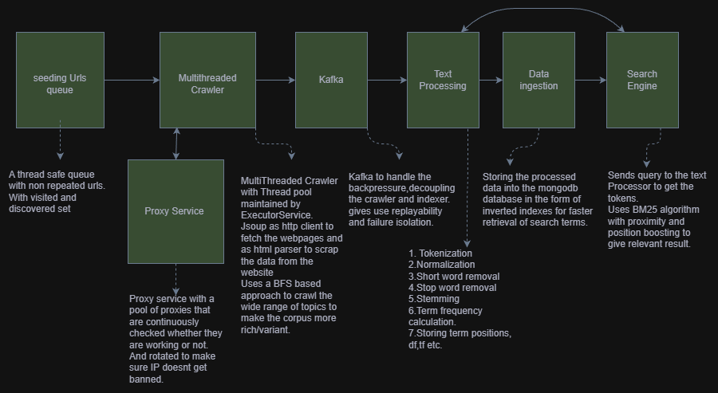
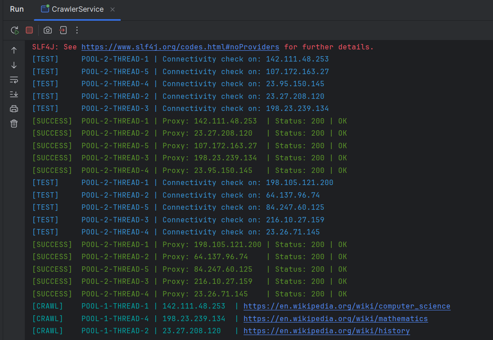
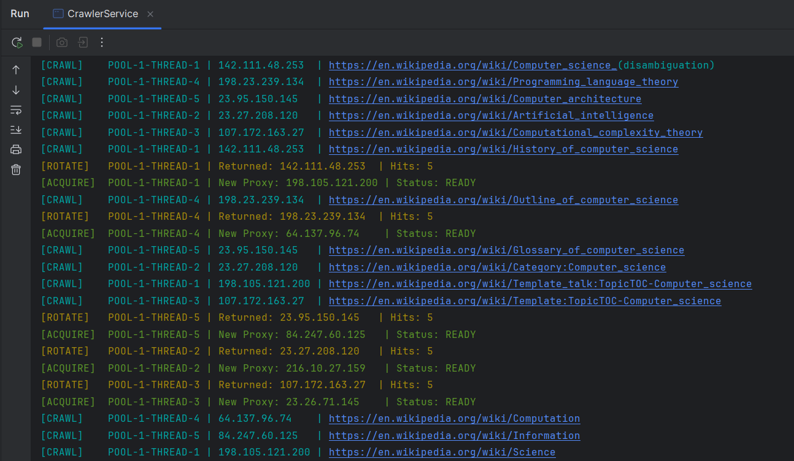
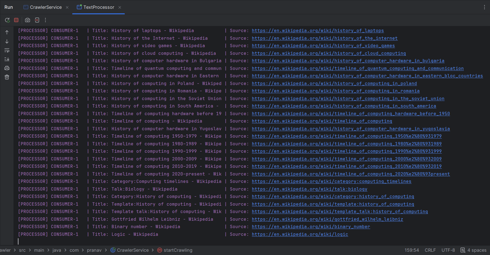
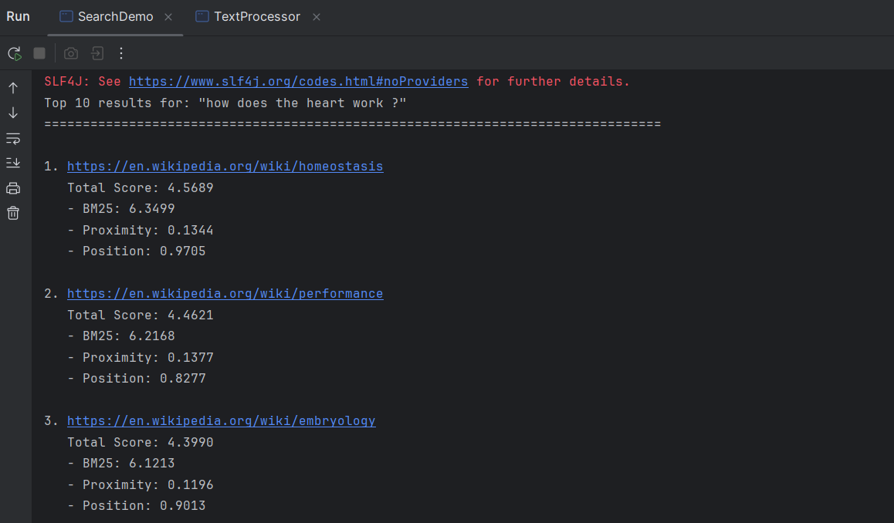
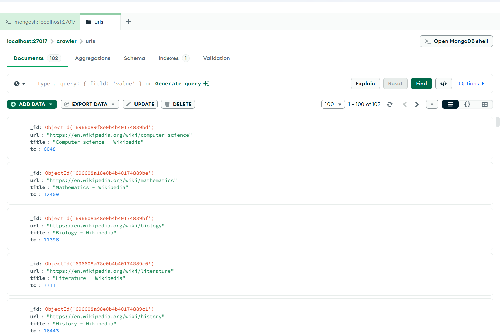
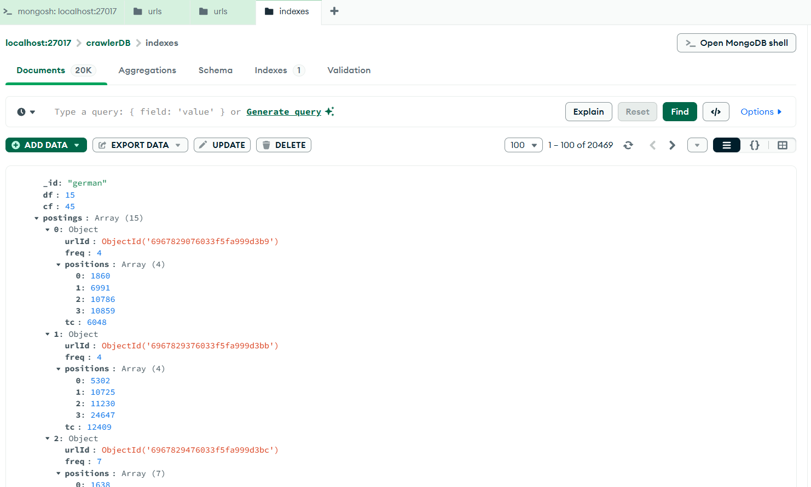

# End-to-End Search Engine (Wikipedia-Based)

A production-inspired **search engine built from scratch in Java**, designed to replicate how modern search systems work internally — from **responsible web crawling** to **indexing**, **ranking**, and **real-time querying**.

This project focuses heavily on **concurrency**, **system design**, **information retrieval**, and **scalability**, rather than being a simple keyword search demo.

---

## 🧠 What This Project Does

The system scraps data directly from Wikipedia, processes and indexes it, and allows users to perform relevance-ranked searches using an enhanced BM25-based ranking strategy.

The pipeline is fully decoupled and resilient, closely resembling real-world backend architectures.

---

## 🏗️ High-Level Architecture

The system is composed of three major services:

1. **Web Crawling Service** – Collects and scrapes Wikipedia pages concurrently
2. **Indexing Pipeline** – Processes text and builds a positional inverted index
3. **Search Service** – Executes ranked queries using BM25 with additional relevance boosts

Communication between the crawler and indexer is handled asynchronously using **Apache Kafka**.

---

## 🕷️ Web Crawler

The crawler is implemented using Java’s concurrency primitives and follows a **Breadth-First Search (BFS)** strategy to ensure wide topic coverage rather than deep traversal.

### Key Capabilities

* Concurrent crawling using a configurable thread pool
* Proxy validation and **automatic proxy rotation** to avoid IP bans
* Full **robots.txt compliance**, including:

    * Allowed / disallowed path enforcement
    * Crawl-delay handling
* URL de-duplication to guarantee each page is crawled only once

### Concurrency Design

* Thread-safe queues for URL scheduling
* Thread-safe visited URL tracking
* Synchronization mechanisms to eliminate race conditions

---

## 📩 Messaging & Backpressure Handling

**Apache Kafka** is used as an intermediary layer between crawling and indexing.

This design choice enables:

* Backpressure handling during crawl spikes
* Loose coupling between services
* Fault isolation and retry capability
* Improved scalability and reliability

---

## 🔎 Text Processing & Indexing

Raw scraped content flows through a multi-stage text processing pipeline:

* Tokenization
* Text normalization
* Stop-word elimination
* Stemming

After processing, documents are converted into a **positional inverted index**, storing:

* Term frequencies
* Document frequencies
* Term positions within documents

The index is persisted in **MongoDB**, enabling efficient lookups and scalable storage.

---

## 📊 Search & Ranking Engine

The query engine ranks documents using a **custom implementation of the BM25 algorithm**, built from scratch.

### Ranking Enhancements

* BM25 for term frequency saturation and length normalization
* Proximity-based boosting to reward closely occurring query terms
* Positional boosting to prioritize documents where terms appear earlier

The result is improved relevance across both short and long documents.

---

## ⚠️ Engineering Challenges Addressed

* Preventing infinite crawling loops through strict URL de-duplication
* Enforcing crawl delays across multiple concurrent threads
* Safely handling shared data structures under heavy concurrency
* Designing a scalable indexing pipeline decoupled via Kafka
* Fine-tuning BM25 scoring combined with proximity and position heuristics

---

## 🛠️ Tech Stack

* **Java** – Core language and concurrency
* **Jsoup** – HTTP fetching and HTML parsing
* **Apache Kafka** – Messaging and backpressure handling
* **MongoDB** – Inverted index storage
* **IntelliJ IDEA** – Development environment
* **Docker** – Running Kafka image

---

## 📚 Key Learnings

* Practical concurrency and synchronization in Java
* Designing fault-tolerant, decoupled backend systems
* Core Information Retrieval (IR) principles used in real search engines
* Importance of ethical web crawling and standards compliance

---

## 📌 Summary

This project is a deep dive into building a real search engine system, combining concepts from **distributed systems**, **backend engineering**, and **information retrieval**. It emphasizes correctness, scalability, and thoughtful system design over shortcuts or abstractions.

---

Feel free to explore the codebase or reach out if you’d like to discuss search systems, backend engineering, or system design in more detail.

## 🎥 Demo Video

[Click Here](https://www.youtube.com/watch?v=RKx3NgIUcN0)

## 📸 Images

Proxy Service checks the proxies first.

Once proxies are check then they are crawled. Once the proxy is used for 5 requests it is rotated with a new proxy.

Once 100 pages are crawled the crawler stops.

Kafka Topic.

Text-Processing Consumer consuming from kafka.

Search Results using BM25 Algorithm.

Mongodb Database with Urls and inverted indexes

